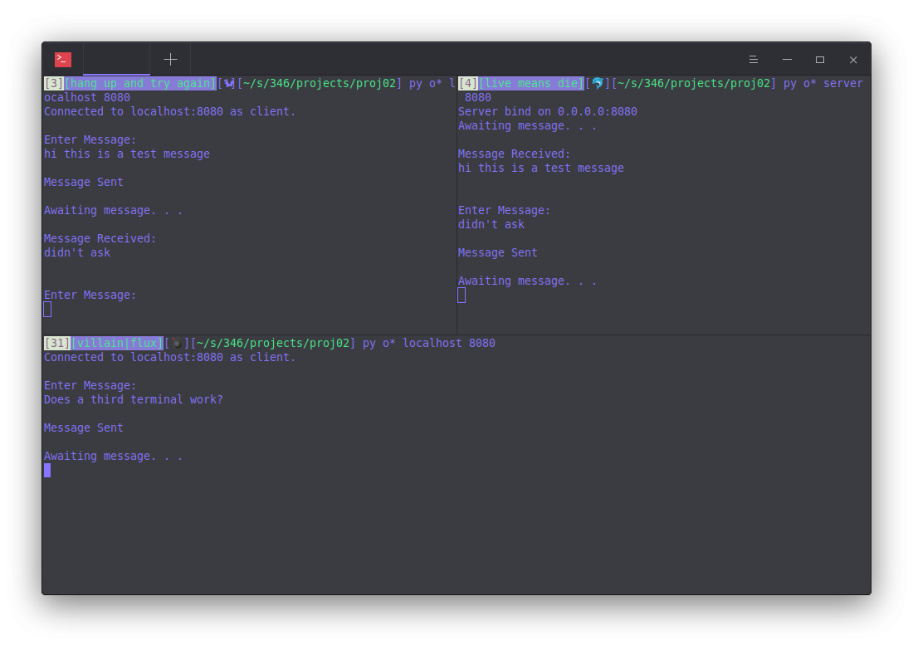

# Observations

*Christian P. Byrne*

### Methods

1. Run server in one terminal
2. Run client in second terminal
3. Run another client in third terminal

---------

### Two Connected Clients

##### Results
The third terminal's message is not reflected in the server's shell. However, once I close the first client, the server receives and displays the message in the buffer from the second client -- regardless of how much time it was waiting. 

##### Discussion
The object controlling the listening socket (`server()` function) is single-threaded. It waits for a new connection, creates a socket object when a connection is received, does the trading messages function with that created socket, and finally loops back once the trading messages function frame is popped (which happens when that socket is closed). 

Trying to establish a socket with the third shell requires that the python process associated with the listening socket proceed to the start of the loop and start listening for connections again -- which will not happen until the trading messages loop terminates between the first client and server.

### Multiple Lines

##### Results
When entering multiple lines, they go into a queue. If the sender queues multiple lines of messages, those messages will be sent immediately on the next iteration of the loop. 

##### Discussion
I think it is because the stdin and stdout streams are distinct. Therefore the `input()` calls on each new iteration will just grab the most recent delimted section of the stdin buffer and the user will not get a chance to type a new message until all those queued messages are sent. 